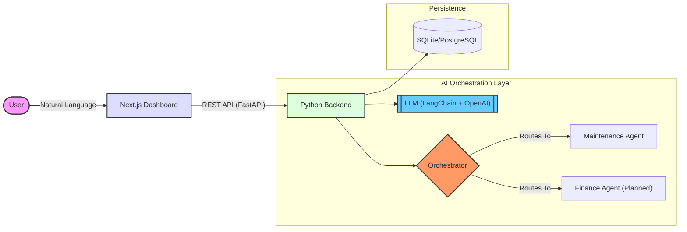

# 🏢 AI-First Property Management System (AI-PMS)

<div align="center">


[](https://nextjs.org/)
[](https://fastapi.tiangolo.com/)
[](https://openai.com/)
[](https://www.docker.com/)
[](https://opensource.org/licenses/MIT)

**Elevating real estate management through intelligent agent orchestration.**

[Explore Features](#-features-that-wow) • [Architecture](#-architecture) • [Getting Started](#-getting-started) • [API Query](#-api-documentation)

</div>

---

## 📖 About The Project

The **AI-First Property Management System (AI-PMS)** is a cutting-edge platform designed to revolutionize how properties are managed. By leveraging **intelligent agent orchestration**, the system autonomously handles complex workflows such as maintenance requests, tenant inquiries, and financial reporting.

Unlike traditional property management software that relies on manual input, **AI-PMS** proactively identifies issues, coordinates with vendors, and interacts with tenants using natural language understanding.

---

## ✨ Features that WOW

### 🤖 Intelligent Orchestration
- **Smart Router**: A sophisticated central agent that interprets user intent and routes tasks to specialized sub-agents.
- **Context Awareness**: Maintains conversation history for seamless follow-up queries.

### 🛠️ Autonomous Maintenance
- **Ticket Generation**: Automatically creates detailed maintenance tickets from user chats.
- **Urgency Assessment**: AI analyzes the problem to determine urgency levels (Low, Medium, High, Emergency).
- **Vendor Simulation**: Simulates assigning tasks to appropriate vendors based on the trade (Plumbing, Electrical, etc.).

### 💳 Premium User Interface
- **Glassmorphic Design**: A sleek, modern dashboard built with **Tailwind CSS** and **Framer Motion**.
- **Real-time Updates**: Live status tracking of maintenance requests.
- **Responsive**: Fully optimized for desktop, tablet, and mobile devices.

### 🏗️ Enterprise-Grade Architecture
- **Scalable Backend**: Powered by **FastAPI** for high performance and async capabilities.
- **Docker-Native**: Fully containerized for consistent deployment across any environment.
- **Secure**: Environment-based configuration and robust input validation.

---

## 🏗️ Architecture

The system follows a microservices-inspired architecture with a clear separation of concerns between the frontend, backend, and AI orchestration layers.



---

## 🛠️ Tech Stack

### Frontend
- **Framework**: [Next.js 14](https://nextjs.org/) (App Router)
- **Styling**: [Tailwind CSS](https://tailwindcss.com/)
- **Animations**: [Framer Motion](https://www.framer.com/motion/)
- **Icons**: [Lucide React](https://lucide.dev/)

### Backend
- **Framework**: [FastAPI](https://fastapi.tiangolo.com/)
- **AI/LLM**: [LangChain](https://www.langchain.com/) & [OpenAI API](https://openai.com/)
- **Database**: SQLite (Dev) / PostgreSQL (Prod ready)
- **Validation**: [Pydantic](https://docs.pydantic.dev/)

### DevOps
- **Containerization**: [Docker](https://www.docker.com/) & Docker Compose
- **Version Control**: Git & GitHub

---

## 🚀 Getting Started

Follow these steps to get the project up and running on your local machine.

### Prerequisites

Ensure you have the following installed:
- [Docker & Docker Compose](https://www.docker.com/products/docker-desktop)
- [Node.js (v18+)](https://nodejs.org/) (for local frontend dev)
- [Python (v3.10+)](https://www.python.org/) (for local backend dev)

### 🐳 Option 1: Running with Docker (Recommended)

1.  **Clone the repository**:
    ```bash
    git clone https://github.com/StartSmart-AI-PropTech/AI-prop-tech.git
    cd AI-prop-tech
    ```

2.  **Set up Environment Variables**:
    Create a `.env` file in the root directory or ensure `backend/.env` exists.
    ```bash
    # Backend .env
    OPENAI_API_KEY=your_openai_api_key_here
    DATABASE_URL=sqlite:///./proptech.db
    ```

3.  **Spin Up the Services**:
    ```bash
    docker-compose up --build
    ```

4.  **Access the Application**:
    - **Dashboard**: [http://localhost:3000](http://localhost:3000)
    - **API Docs**: [http://localhost:8000/docs](http://localhost:8000/docs)

### Option 2: Manual Setup

#### 1. Backend Setup
```bash
cd backend
python -m venv venv

# Windows
venv\Scripts\activate
# Mac/Linux
source venv/bin/activate

pip install -r requirements.txt

# Create .env file with your OPENAI_API_KEY
echo "OPENAI_API_KEY=your_key" > .env

uvicorn app.main:app --reload
```
The backend will run on `http://localhost:8000`.

#### 2. Frontend Setup
```bash
cd frontend
npm install

# Create .env.local
echo "NEXT_PUBLIC_API_URL=http://localhost:8000" > .env.local

npm run dev
```
The frontend will run on `http://localhost:3000`.

---

## 📂 Project Structure

```text
├── backend/
│   ├── app/
│   │   ├── agents/         # AI Agent logic (Orchestrator, Maintenance)
│   │   ├── api/            # API Routes (Endpoints)
│   │   ├── core/           # Config, Database, Security
│   │   ├── models/         # Database Models
│   │   ├── schemas/        # Pydantic Schemas
│   │   └── main.py         # Application Entry Point
│   ├── Dockerfile
│   └── requirements.txt
├── frontend/
│   ├── app/                # Next.js App Router Pages
│   ├── components/         # Reusable UI Components
│   ├── public/             # Static Assets
│   ├── tailwind.config.ts  # Tailwind Configuration
│   └── Dockerfile
├── docker-compose.yml      # Docker Orchestration
└── README.md               # Project Documentation
```

---

## 🗺️ Roadmap

- [ ] **Finance Agent**: Automate rent collection and expense tracking.
- [ ] **Onboarding Agent**: AI-driven tenant screening and digital lease signing.
- [ ] **Mobile App**: React Native mobile application for tenants and landlords.
- [ ] **Analytics Dashboard**: Advanced data visualization for property performance.

---

## 🤝 Contributing

Contributions are what make the open-source community such an amazing place to learn, inspire, and create. Any contributions you make are **greatly appreciated**.

1. Fork the Project
2. Create your Feature Branch (`git checkout -b feature/AmazingFeature`)
3. Commit your Changes (`git commit -m 'Add some AmazingFeature'`)
4. Push to the Branch (`git push origin feature/AmazingFeature`)
5. Open a Pull Request

---

## 📜 License

Distributed under the MIT License. See `LICENSE` for more information.

---

<div align="center">
  <sub>Built with ❤️ by the AI PropTech Team.</sub>
</div>
