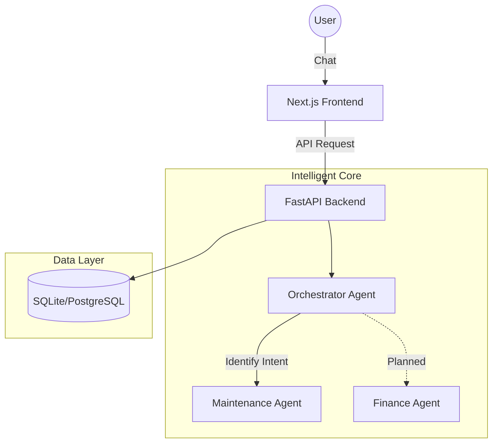

<div align="center">
  
  
  
  
  
  # 🏢 AI-First Property Management System (AI-PMS)
  **Elevating real estate management through intelligent agent orchestration.**
  
  [Explore Features](#-features-that-wow) • [Quick Start](#-getting-started) • [Architecture](#-architecture)
</div>

---

## ✨ Features that WOW

*   **🤖 Smart Orchestrator**: A sophisticated central agent that understands intent and routes tasks to specialized sub-agents.
*   **🛠️ Autonomous Maintenance**: End-to-end maintenance flow—problem description, urgency assessment, and simulated vendor assignment.
*   **💳 Premium Dashboard**: A sleek, glassmorphic UI built with Next.js 14, Tailwind CSS, and Framer Motion.
*   **🐳 Docker-Native**: Fully containerized for consistent deployment across any environment.

---

## 🏗️ Architecture



---

## 🚀 Future Roadmap

- [ ] **Finance Agent**: Full automation for rent collection, invoice generation, and financial reporting.
- [ ] **Onboarding Agent**: AI-driven tenant screening and digital lease signing.
- [ ] **Property Analytics**: Predictive insights for vacancy risk and ROI optimization.

---

## 🛠️ Getting Started

### 🐳 Running with Docker (Recommended)

1.  **Clone & Enter**:
    ```bash
    git clone https://github.com/Charansaiputta13/AI-prop-tech.git
    cd AI-prop-tech
    ```

2.  **Spin Up**:
    ```bash
    docker compose up --build
    ```

3.  **Access**:
    *   **Dashboard**: `http://localhost:3000`
    *   **API Docs**: `http://localhost:8000/docs`

---

## 📄 Development Flow

If you prefer to run things manually:

#### 🐍 Backend Setup
```bash
cd backend
python -m venv venv
venv\Scripts\activate
pip install -r requirements.txt
uvicorn app.main:app --reload
```

#### ⚛️ Frontend Setup
```bash
cd frontend
npm install
npm run dev
```

---

<div align="center">
  <sub>Built with ❤️ for the future of PropTech.</sub>
</div>
